<h1 align="center">SberRunner</h1>

<p align="center">  
Simple app to keep track of your runs.  
With this app you can follow your running path, it calculates your distance speed and your calories burned.
Your information stored internally in Room database and externally in Firestore Cloud allowing you to sync
progress between multiple devices.
</p>


## Tech stack & Open-source libraries
- Minimum SDK level 23
- [100% Kotlin](https://kotlinlang.org/)
- [RxJava 3](https://github.com/ReactiveX/RxJava)
- [Dagger 2](https://dagger.dev/) for dependency injection.
- Firebase
    - Firebase Authentication - Login and registration handler.
    - FireStore - Cloud-hosted, NoSQL database
- JetPack
    - ViewModel - UI related data holder, lifecycle aware.
    - Room - Constructing a database using the abstract layer.
    - Constraint Layout - Position and size widgets in a flexible way with relative positioning. 
    - RecyclerView - Display large sets of data in your UI while minimizing memory usage.
    - ViewPager 2 - Display Views or Fragments in a swipeable format.
    - ViewBinding - Allows you to more easily write code that interacts with views.
- Architecture
    - MVVM Architecture (View - ViewModel - Interactor - Data)
    - Repository pattern
- [GoogleMaps](https://developers.google.com/maps) - View and interact with Google Maps using Api.
- [Glide](https://github.com/bumptech/glide), [GlidePalette](https://github.com/florent37/GlidePalette) - Loading images.
- [Material-Components](https://github.com/material-components/material-components-android) - Material design components like ripple animation, cardView.
- [SwipeToRefresh](https://developer.android.com/reference/androidx/swiperefreshlayout/widget/SwipeRefreshLayout) - Refresh the contents of a view via a vertical swipe gesture.
- [Easy Permissions](https://github.com/googlesamples/easypermissions) - Is a wrapper library to simplify basic system permissions logic.
- [Toasty](https://github.com/GrenderG/Toasty) - The better looking version of Toast.
- [Lottie](https://github.com/airbnb/lottie-android) - Parses Adobe After Effects animations exported as json with Bodymovin and renders them natively on mobile!

Welcome Screens
-----------

<p float="left">
  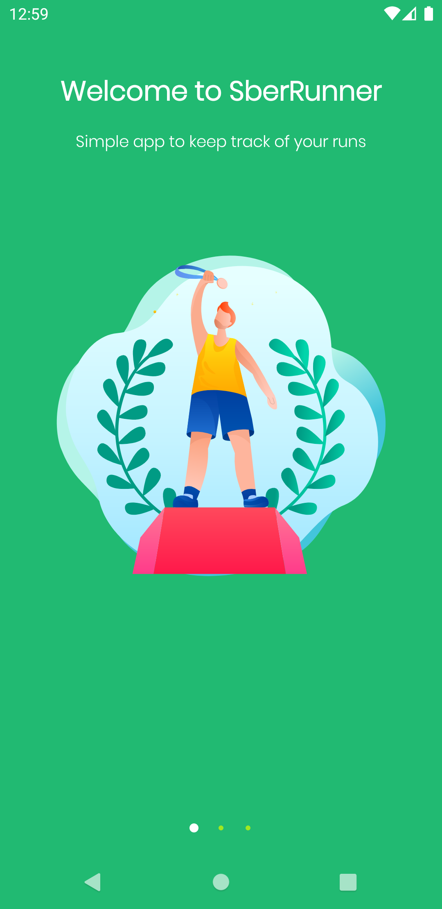
  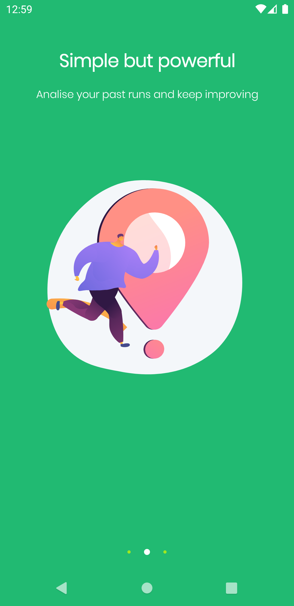 
  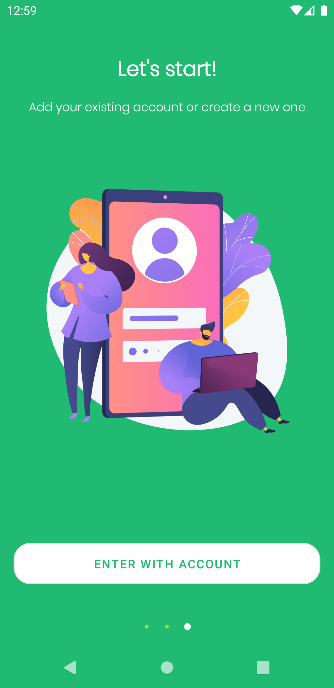 
</p>

Login and Registration Screens
-----------

<p float="left">
  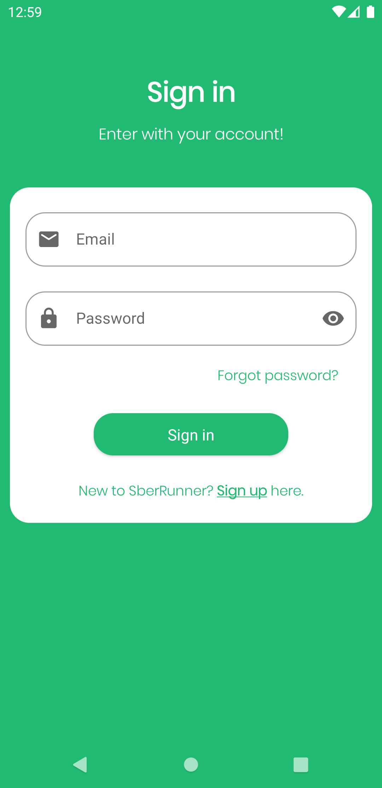
  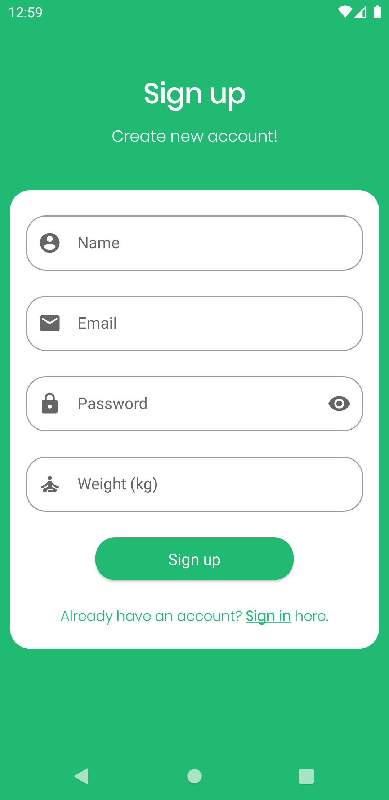 
  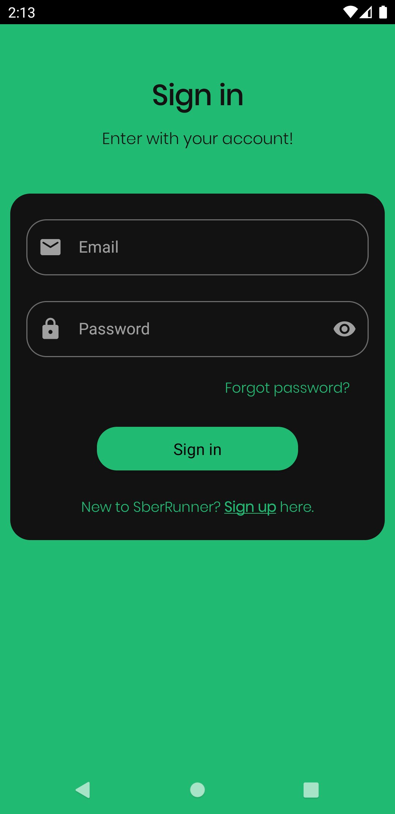
  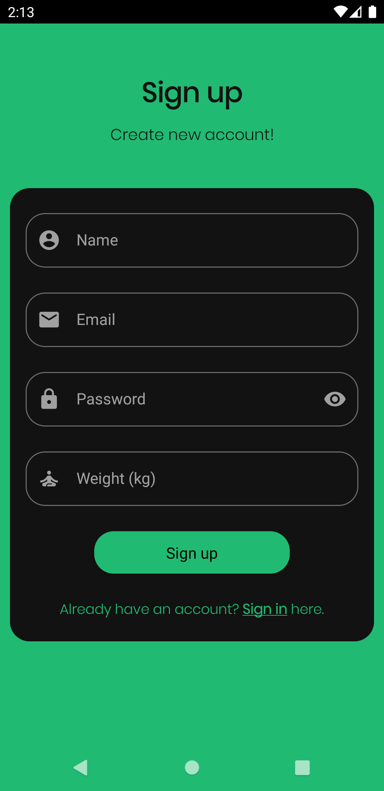 
</p>

List of Runs with Detailed Information Screens
-----------

<p float="left">
  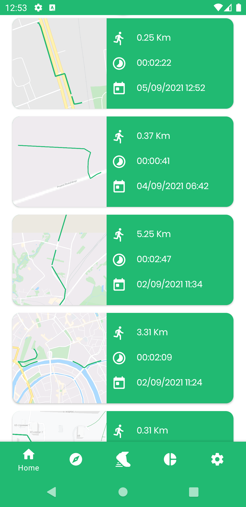
  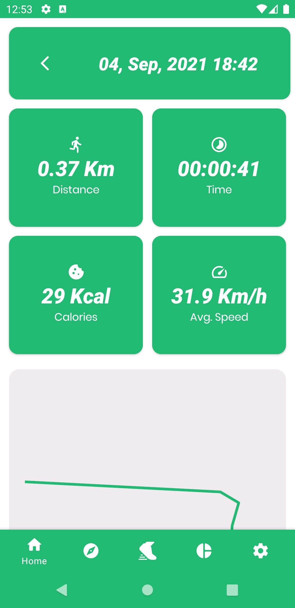 
  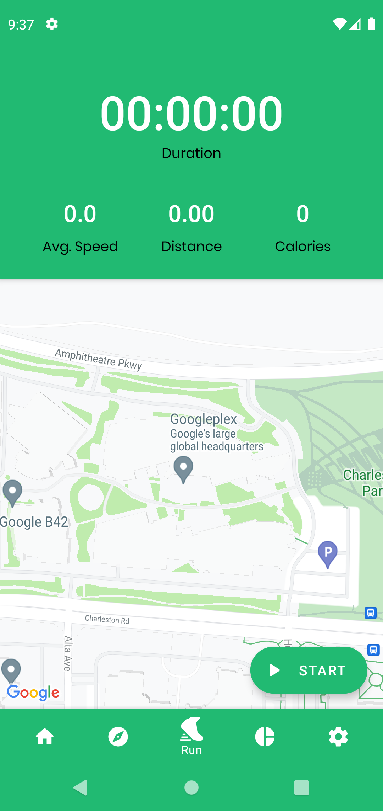
  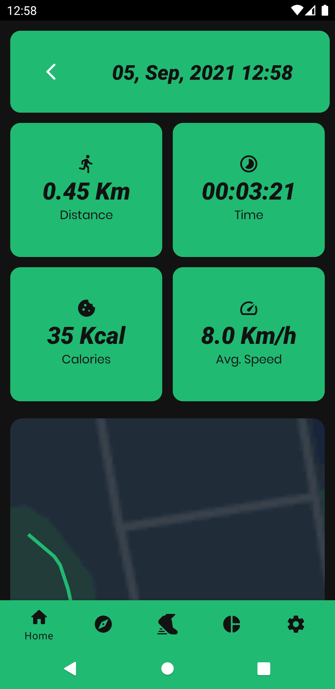 
</p>

Running Activity and Map Screens
-----------

<p float="left">
  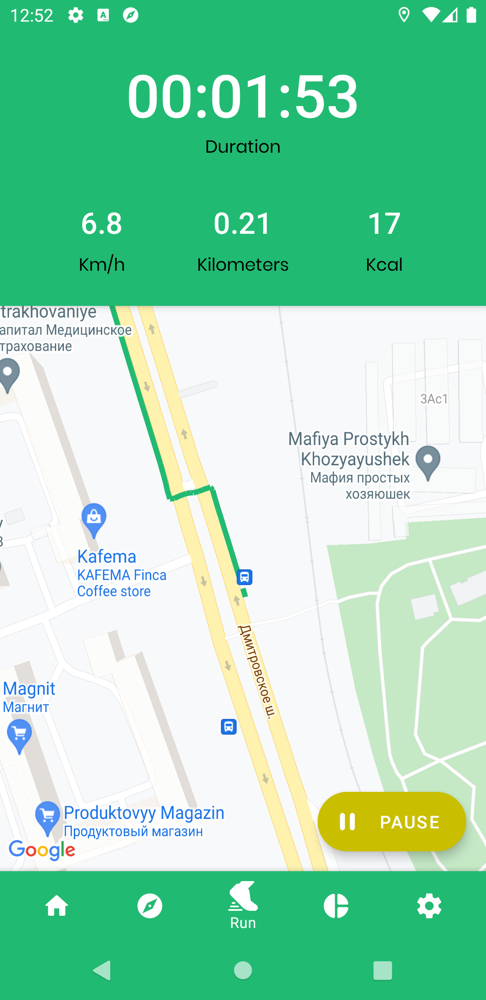
  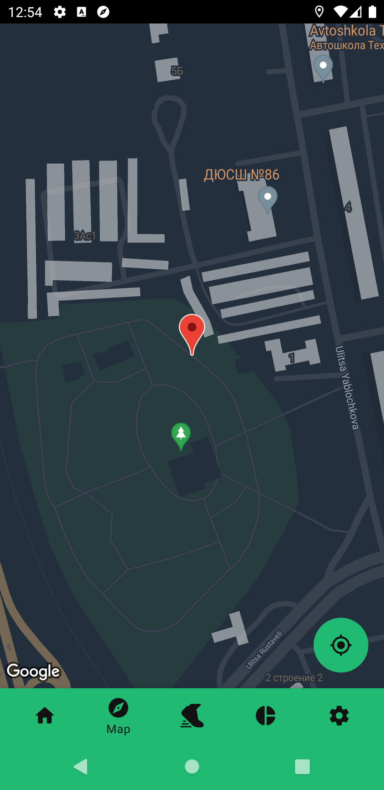 
  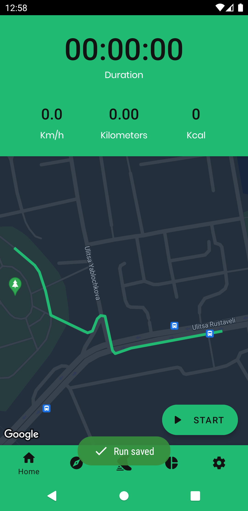
  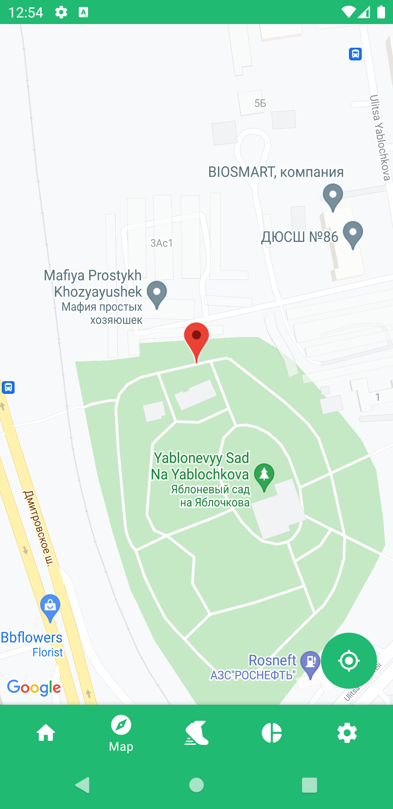 
</p>

Progress and Settings Screens
-----------

<p float="left">
  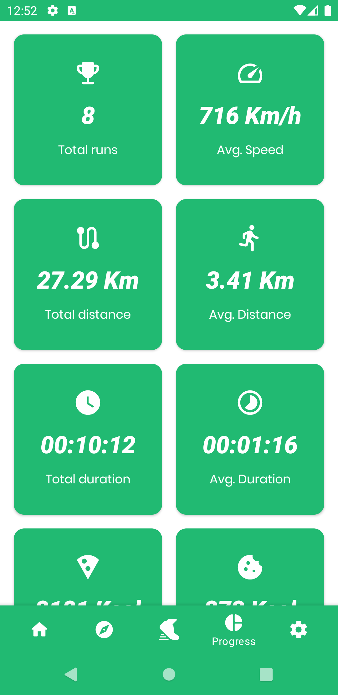
  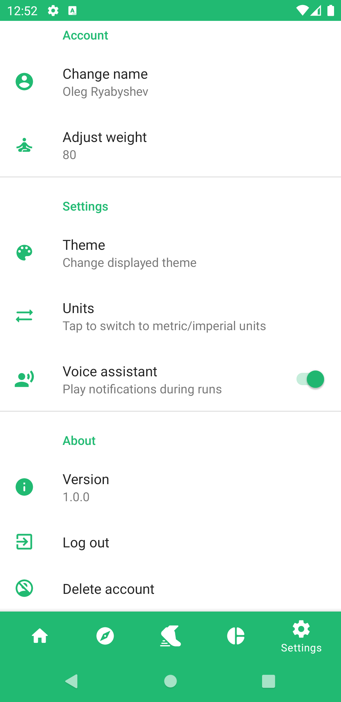 
  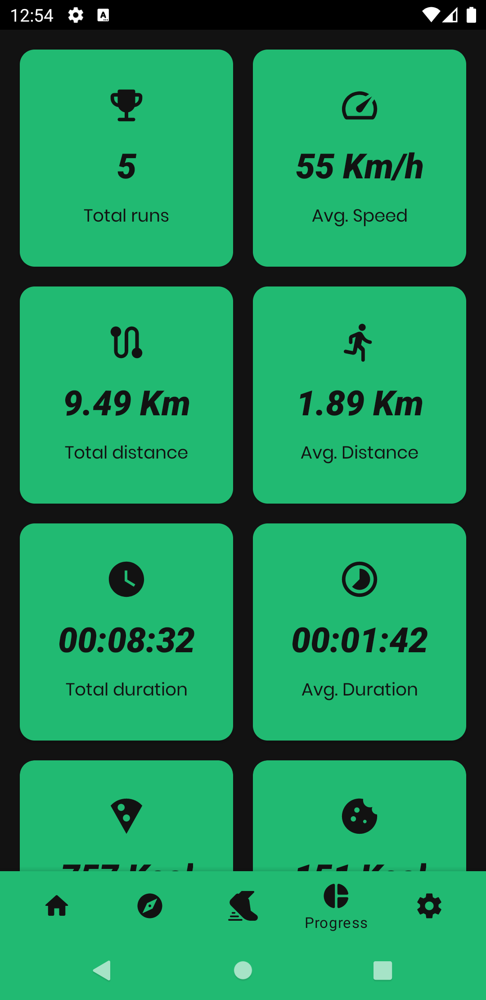
  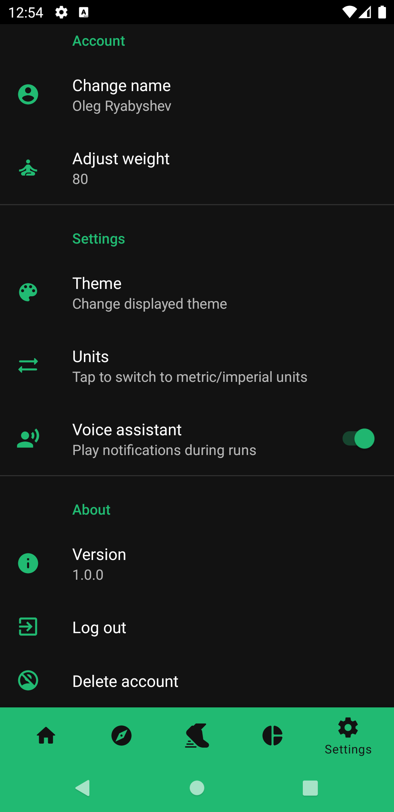 
</p>

# License
```
    Sberrunner
    Copyright 2021
    Ryabyshev Oleg, Android Kotlin Developer
    Russia, Moscow
```