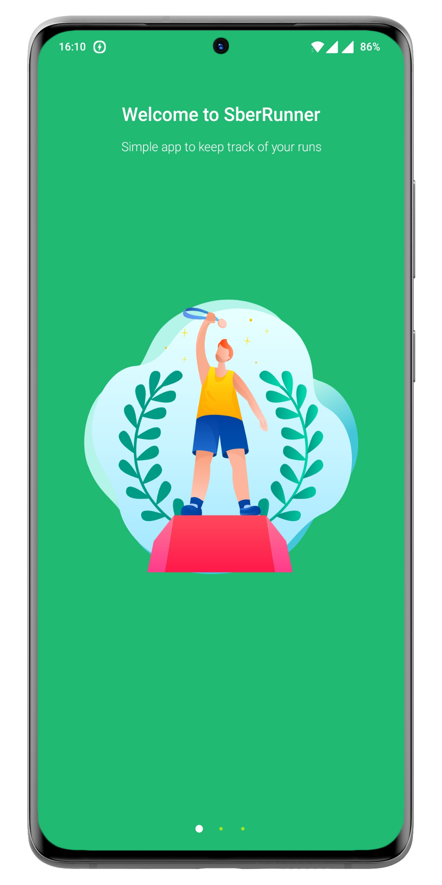
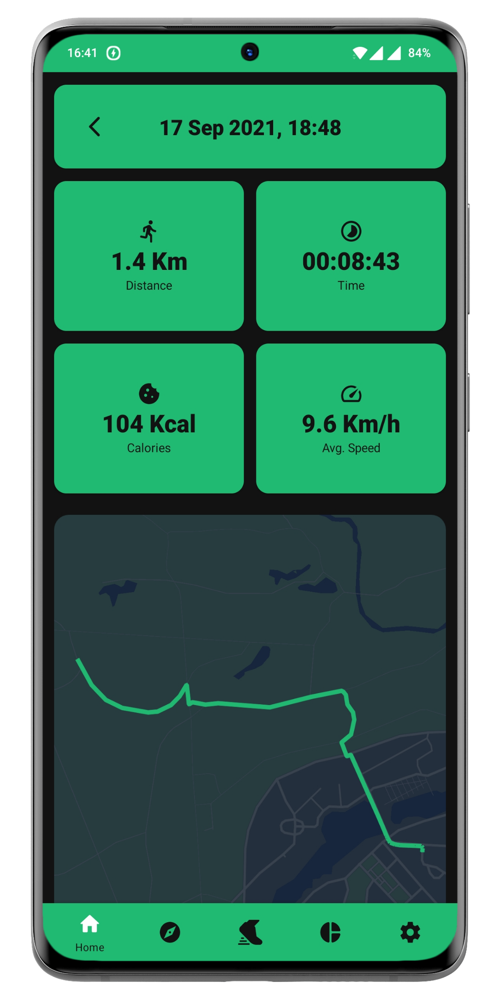
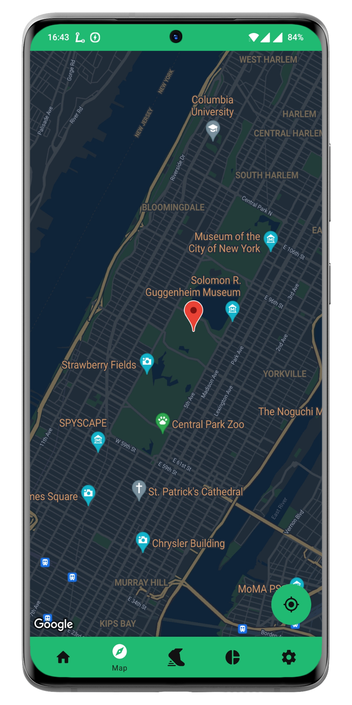
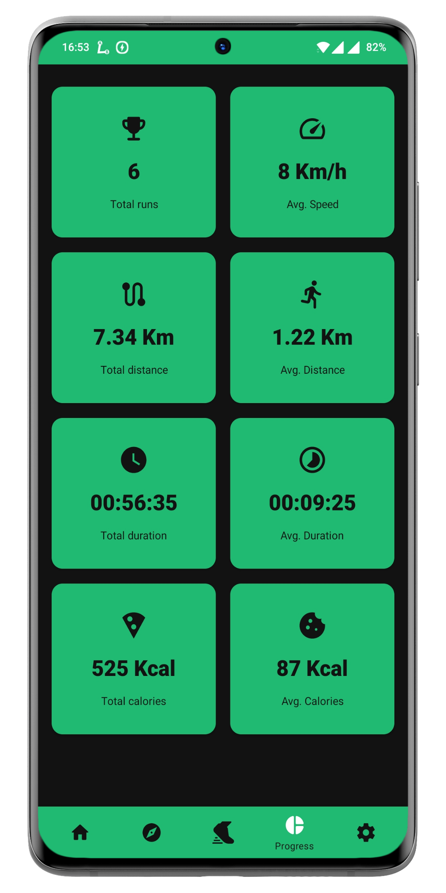
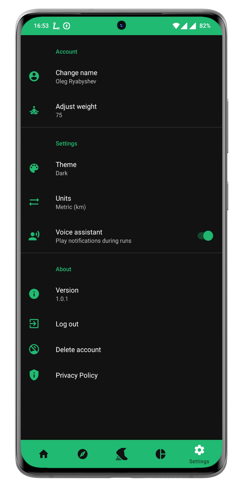

<h1 align="center">SberRunner</h1>

- Simple app to keep track of your runs
- Calculate your distance, speed and calories burned in real time
- Can work in the background using service
- Your information stored internally in Room database and externally in Firestore Cloud 
- Progress can be synced between multiple devices
- Full English/Russian translation
- Metric / Imperial units supported
- Dark / Light theme available
- Audio notificator during active runs: Provides information about your distance and current state
- Progress page with useful information about your activities

<br />

<p align="left">
  
</p>

<p align="left">
    <a href='https://play.google.com/store/apps/details?id=xyz.fcr.sberrunner'>
        
    </a>
</p>    

## Tech stack & Open-source libraries
- Minimum SDK level 23
- [Kotlin](https://kotlinlang.org/) - 100%
- Architecture
    - MVVM Architecture (View - ViewModel - Domain - Data)
- [RxJava 3](https://github.com/ReactiveX/RxJava) - library for composing asynchronous and event-based programs by using observable sequences.
- [Dagger 2](https://dagger.dev/) - for dependency injection.
- Firebase
    - [Firebase Authentication](https://firebase.google.com/docs/auth) - Login and registration handler.
    - [Cloud Firestore](https://firebase.google.com/docs/firestore) - Cloud-hosted, NoSQL database for storing runs information.
    - [Firebase Storage](https://firebase.google.com/docs/storage) - Cloud-hosted storage for saving images with your runs.
- JetPack
    - ViewModel - UI related data holder, lifecycle aware.
    - [Room](https://developer.android.com/training/data-storage/room) - Constructing a database using the abstract layer.
    - Constraint Layout - Position and size views in a flexible way with relative positioning. 
    - [RecyclerView](https://developer.android.com/guide/topics/ui/layout/recyclerview) - Display large sets of data in your UI while minimizing memory usage.
    - [ViewPager 2](https://developer.android.com/jetpack/androidx/releases/viewpager2) - Display Views or Fragments in a swipeable format (used for welcome screens).
    - [View Binding](https://developer.android.com/topic/libraries/view-binding) - Allows you to more easily write code that interacts with views.
- [GoogleMaps](https://developers.google.com/maps) - View and interact with Google Maps using Api.
- [MediaPlayer](https://developer.android.com/reference/android/media/MediaPlayer) - MediaPlayer can be used to control play audio notification during runs.
- [Glide](https://github.com/bumptech/glide) - Loading images asynchronously.
- [Material-Components](https://github.com/material-components/material-components-android) - Material design components.
- [SwipeToRefresh](https://developer.android.com/reference/androidx/swiperefreshlayout/widget/SwipeRefreshLayout) - Refresh the contents of a view via a vertical swipe gesture.
- [Easy Permissions](https://github.com/googlesamples/easypermissions) - Is a wrapper library to simplify basic system permissions logic.
- [Toasty](https://github.com/GrenderG/Toasty) - The better version of Toast.
- [Lottie](https://github.com/airbnb/lottie-android) - Parses Adobe After Effects animations exported as json with Bodymovin and renders them natively on mobile.

Welcome Screens
-----------

- Swipable welcome screen via ViewPager2 + TabLayout

<p float="left">
  
   
   
</p>

Login and Registration Screens
-----------

- Full authentication and registration logic via Firebase
- Error checking during filling fields

<p float="left">
  
   
</p>

List of Runs with Detailed Information Screens
-----------

- List of all of your run history with detailed information about each one

<p float="left">
  
  
</p>

Running Activity and Map Screens
-----------

- Full separate service that can track your run in the background
- Audio notifications helper during active runs

<p float="left">
  
   
</p>

Progress and Settings Screens
-----------

- Page to setup SberRunner in the way you like it

<p float="left">
  
   
</p>

# License
```
    Sberrunner
    Copyright 2021
    Ryabyshev Oleg,
    Android Kotlin Developer
    Russia, Moscow
```
